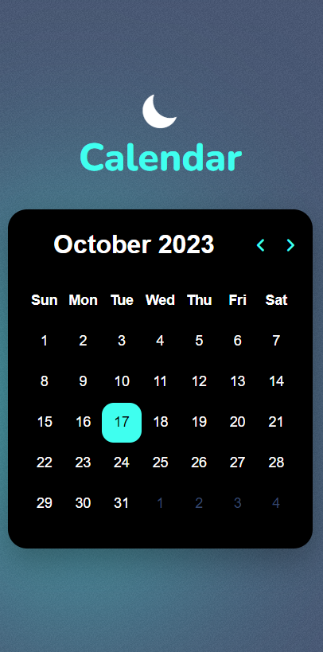
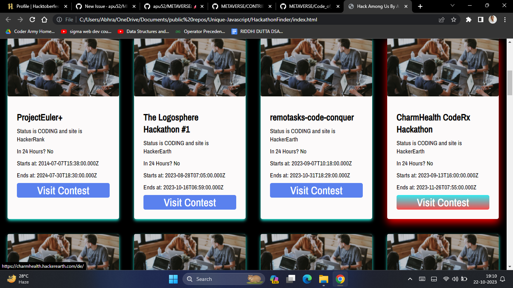
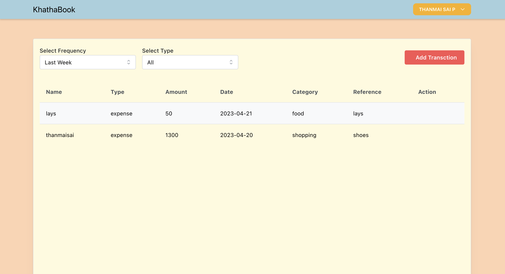

<h1>Front-end Projects</h1>
<h2>Update this list after Adding New Projects</h2>

<h3>Login Page  <! --Name of your new Project --> </h3>

 Hello Coders👨‍💻 ,I am Suryanshu Paul, a aspiring Web developer.🤖 Here is the project of the front-end Web Developement. This is a frontend part of a login page. I used HTML and CSS .
  
.png)

<h3>Survey From  <! --Name of your new Project --> </h3>

 <! --Describe the Tech Stack of your Project-->
Hello Coders👨‍💻 ,I am Suryanshu Paul, a aspiring Web developer.🤖 Here is the project of the front-end Web Developement. So, here is the frontend of a survey form .I used HTML and CSS .

.png>)

<h3>GOOGLE_DRIVE_CLONE Clone  <! --Name of your new Project --> </h3>

 <! --Describe the Tech Stack of your Project-->
Hello Coders👨‍💻 ,I am Suryanshu Paul, a aspiring Web developer.🤖 Here is the project of the front-end Web Developement. We all use the most famous streaming platform Google Drive. So, here is the frontend clone of the landing page👆🏻 .I used HTML and CSS .

.png>)

<h3>WakeMeUp  <! --Name of your new Project --> </h3>

 <! --Describe the Tech Stack of your Project-->
I used HTML, CSS and Javascript .

<h3>Hotstar Clone  <! --Name of your new Project --> </h3>

 <! --Describe the Tech Stack of your Project-->
Hello Coders👨‍💻 ,I am Arpan Chowdhury, a aspiring Web developer.🤖 Here is the project of the front-end Web Developement. We all use the most famous streaming platform HOTSTAR. So, here is the frontend clone of the landing page👆🏻 .I used HTML, CSS and Javascript .

<h3>STACK  <! --Name of your new Project --> </h3>

 <! --Describe the Tech Stack of your Project-->
Hello Coders👨‍💻 ,I am Suryanshu Paul , a aspiring Web developer.🤖 Here is the project of the front-end Web Developement. This is a most famous data structure  STACK. I used HTML, CSS and Javascript .

.png)

<h3>Instagram Clone  <! --Name of your new Project --> </h3>

 <! --Describe the Tech Stack of your Project-->
Hello Coders👨‍💻 ,I am Arpan Chowdhury, a aspiring Web developer.🤖 Here is the project of the front-end Web Developement. We all use the most famous social media platform INSTAGRAM. I used HTML, CSS and Javascript .

<h3>Weather Application  <! --Name of your new Project --> </h3>

 <! --Describe the Tech Stack of your Project--> 
Hello everyone, in this project i have used HTML CSS JS(rapid api) to build a weather application.
  

<h3>Stopwatch <! --Name of your new Project --> </h3>

 <! --Describe the Tech Stack of your Project-->
Hello Coders👨‍💻 ,I am Arpan Chowdhury, a aspiring Web developer.🤖 Here is the project of the front-end Web Developement. We all use the most famous Application in our phone named STOPWATCH.I used HTML, CSS and Javascript .

https://github.com/apu52/Stopwatch-maker/assets/114172928/2cc065fe-f0bd-4759-9fa9-71d50844f31c

<h3>Book Review Website  <! --Name of your new Project --> </h3>

 <! --Describe the Tech Stack of your Project-->
I used HTML, CSS and will be adding Javascript .

<h3>QR ID Card Generator</h3>

 I used HTML, CSS and Javascript for the project. I used Javascript to generate and update QR code according to the information. Now I have also added some styling to the project.

<h3>Tindog:Startup website  <! --Name of your new Project --> </h3>

 <! --Describe the Tech Stack of your Project-->
I used HTML, CSS and Bootstrap

<h3>Calendar App</h3>

Tech stack used : HTML, CSS, Javascript

Description : General purpose calendar with dark & light mode + some animation

<h3>Hack Among Us</h3>

Tech stack used : HTML, CSS, Javascript

Description : This website can help you finding hackathons all over the world

<h3>A-Unit-Converter<! --Name of your new Project --> </h3>

 <! --Describe the Tech Stack of your Project-->
I have used HTML, CSS(Bootstrap) and Javascripts

<h3>A To-Do List Project  <! --Name of your new Project --> </h3>

 <! --Describe the Tech Stack of your Project-->
I used HTML, CSS(Bootstrap) and Javascript

<h3>Finance Tracker</h3>

Tech stack used : react,crypto-js,firebase,mantine

Description : A react app which is used to track all tranctions, you can over look at the expences and even the savings

<h3>Url Shortener</h3>

Tech stack used : Html,Css and Js

Description : An URL shortener is a website that reduces the length of your URL (Uniform Resource Locator). The idea is to minimize the web page address into something that’s easier to remember and track. 

<h3>Code Editor(Html,Css and Js)</h3>

Tech stack used : Html,Css and Js

Description : A code editor is a software application that allows programmers to write and edit code. Code editors have features that help programmers write and edit code more efficiently.

<h3>E-Commerce Website</h3>

Tech stack used : Html,Css and Js

Description: An ecommerce website is a website that allows you to buy and sell products or services online. Ecommerce websites can be designed to sell: Physical products, Digital products, Services.

<h1>Restaurant Website(Frontend project)</h1>
<h2>This is a simple Frontend based projects names Restaurant Website.</h2>

Here is the live link to this website: https://suraj-kumar00.github.io/Restaurant_Website/

<h3>Score Keeper</h3>

Tech stack used : Html,Css and Js

Description: The easy-to-use score keeper for all your games or other activities. • Keep track of scores for any game or activity. • Customizable design to fit your needs. • Add and keep scores with a simple tap. • Choose the amount by which scores are increased or decreased. 

<h3>Quiz App</h3>

Tech stack used : Html,Css and Js

Description: Quiz apps are games that allow players to answer questions on a certain topic. Quiz apps can be used to create, take, and share quizzes. 

Age-Calculator
<h3>Age Calculator</h3>

Tech stack used : Html,Css and Js

Description: The Age Calculator can determine the age or interval between two dates. The calculated age will be displayed in years, months, Date of Birth.

Text-to-Voice-Converter
<h3>Text to Voice Converter</h3>

Tech stack used : Html,Css and Js

Description: Text-to-speech (TTS) is a type of assistive technology that reads digital text aloud.

Quote-Generator
<h3>Quote Generator</h3>

Tech stack used : Html,Css and Js

Description: A quote generator is a tool that can create quotes on a variety of topics. Some quote generators can also personalize quotes with fonts, colors, and text styles.

Meme-Generator
<h3>Meme Generator</h3>

Tech stack used : Html,Css and Js

Description : Meme Generator allows users to create and share image macros (featuring a picture, or artwork, superimposed with text) in the style of popular internet memes.

Music Player Clone
<h3>Music Player</h3>

Tech stack used : Html,Css

Description : A music player is a device or application that plays digital audio files. Music players can be hardware or software.

CountDown-Homepage
Launching Page
<h3>Launching Page</h3>

Tech stack used : Html,Css and Js

Description : Creating a beautiful Launching page with the help using Html ,Css and Js.

Digital-Clock
Digtial Clock
<h3>Digital Clock</h3>

Tech stack used : Html,Css and Js

Description : A digital clock is a clock that displays the time in a digital format, such as on a watch, phone, or an alarm clock. It shows the time in numerals or other symbols, such as 12 and 24-hour formats.

Pop-Up-Modal-Box
Pop Up Modal Box
<h3>Pop Up Modal Box</h3>

Tech stack used : Html,Css and Js

Description :  modal popup box is a dialog box that appears on top of a web page and prevents interaction with the page.

