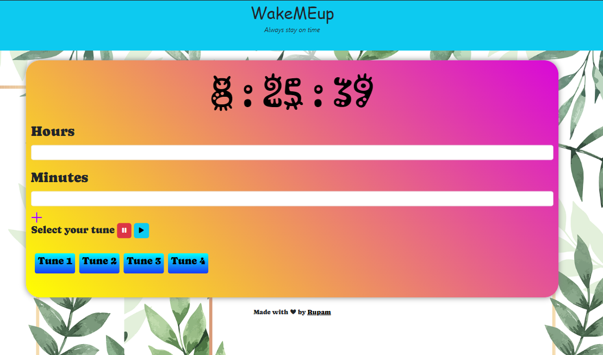

<h1>Front-end Projects</h1>
<h2>Update this list after Adding New Projects</h2>

<h3>GOOGLE_DRIVE_CLONE Clone  <! --Name of your new Project --> </h3>

 <! --Describe the Tech Stack of your Project-->
Hello Coders👨‍💻 ,I am Suryanshu Paul, a aspiring Web developer.🤖 Here is the project of the front-end Web Developement. We all use the most famous streaming platform Google Drive. So, here is the frontend clone of the landing page👆🏻 .I used HTML and CSS .

.png)

<h3>WakeMeUp  <! --Name of your new Project --> </h3>

 <! --Describe the Tech Stack of your Project-->
I used HTML, CSS and Javascript .

<!-- if possible please attach the image of yor project -->

<h3>Hotstar Clone  <! --Name of your new Project --> </h3>

 <! --Describe the Tech Stack of your Project-->
Hello Coders👨‍💻 ,I am Arpan Chowdhury, a aspiring Web developer.🤖 Here is the project of the front-end Web Developement. We all use the most famous streaming platform HOTSTAR. So, here is the frontend clone of the landing page👆🏻 .I used HTML, CSS and Javascript .

<h3>Instagram Clone  <! --Name of your new Project --> </h3>

 <! --Describe the Tech Stack of your Project-->
Hello Coders👨‍💻 ,I am Arpan Chowdhury, a aspiring Web developer.🤖 Here is the project of the front-end Web Developement. We all use the most famous social media platform INSTAGRAM. I used HTML, CSS and Javascript .

<h3>Weather Application  <! --Name of your new Project --> </h3>

 <! --Describe the Tech Stack of your Project--> 
Hello everyone, in this project i have used HTML CSS JS(rapid api) to build a weather application.
  

<h3>Stopwatch <! --Name of your new Project --> </h3>

 <! --Describe the Tech Stack of your Project-->
Hello Coders👨‍💻 ,I am Arpan Chowdhury, a aspiring Web developer.🤖 Here is the project of the front-end Web Developement. We all use the most famous Application in our phone named STOPWATCH.I used HTML, CSS and Javascript .

https://github.com/apu52/Stopwatch-maker/assets/114172928/2cc065fe-f0bd-4759-9fa9-71d50844f31c

<h3>Book Review Website  <! --Name of your new Project --> </h3>

 <! --Describe the Tech Stack of your Project-->
I used HTML, CSS and will be adding Javascript .

<h3>QR ID Card Generator</h3>

 I used HTML, CSS and Javascript for the project. I used Javascript to generate and update QR code according to the information. Now I have also added some styling to the project.

<h3>Tindog:Startup website  <! --Name of your new Project --> </h3>

 <! --Describe the Tech Stack of your Project-->
I used HTML, CSS and Bootstrap

<h3>Calendar App</h3>

Tech stack used : HTML, CSS, Javascript

Description : General purpose calendar with dark & light mode + some animation

<h3>Hack Among Us</h3>

Tech stack used : HTML, CSS, Javascript

Description : This website can help you finding hackathons all over the world

<h3>A-Unit-Converter<! --Name of your new Project --> </h3>

 <! --Describe the Tech Stack of your Project-->
I have used HTML, CSS(Bootstrap) and Javascripts

<h3>A To-Do List Project  <! --Name of your new Project --> </h3>

 <! --Describe the Tech Stack of your Project-->
I used HTML, CSS(Bootstrap) and Javascript

<h3>Finance Tracker</h3>

Tech stack used : react,crypto-js,firebase,mantine

Description : A react app which is used to track all tranctions, you can over look at the expences and even the savings

<h3>Url Shortener</h3>

Tech stack used : Html,Css and Js

Description : An URL shortener is a website that reduces the length of your URL (Uniform Resource Locator). The idea is to minimize the web page address into something that’s easier to remember and track. 

