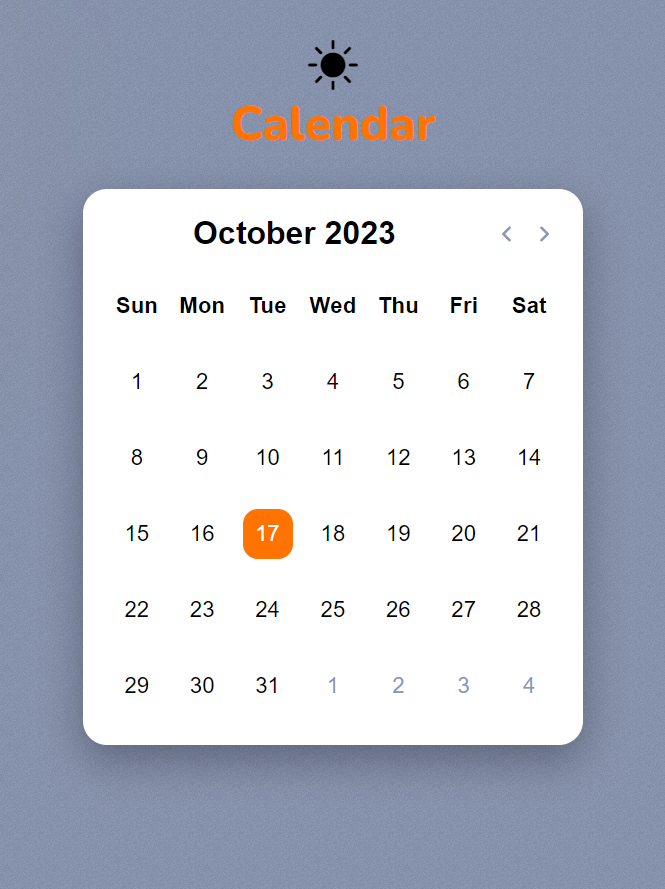
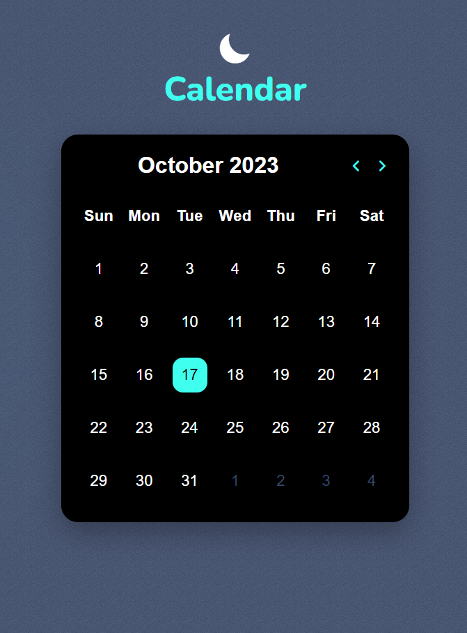

# A Calendar Website  📚
- A general calendar website

## Tech Stack 🌐
- HTML, CSS, Javascript

## Features  🌟
- The responsive website will display a general purpose calendar
- Current date will be highlighted
- two themes available - dark & light
- little animations can also be found

