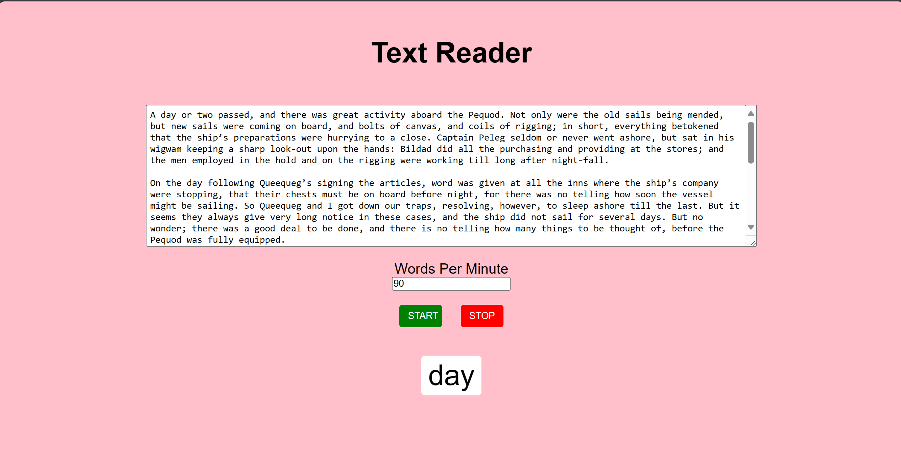

Certainly! Here's a simple README for your text reader app:

---

# Text Reader App

## Overview

The Text Reader App is a web-based application created with HTML, CSS, and JavaScript. It allows users to read text at their preferred speed, enhancing their reading experience.

## Features

- **Text Display:** The app displays the text content on the screen.
- **Speed Control:** Users can choose the reading speed that suits their preference.
- **User-Friendly Interface:** The interface is designed for ease of use, with simple controls.

## Technologies Used

- **HTML:** Markup language for structuring the content.
- **CSS:** Stylesheet language for styling the app's appearance.
- **JavaScript:** Programming language for adding interactivity and functionality.

## Usage

1. **Clone the Repository:**
   ```bash
   git clone https://github.com/your-username/text-reader-app.git
   ```

2. **Open the HTML File:**
   Open the `index.html` file in your preferred web browser.

3. **Adjust Reading Speed:**
   - Use the speed control feature to set your desired reading speed.

4. **Paste Text:**
   - Paste or input the text you want to read into the designated area.

5. **Click "Read":**
   - Click the "Read" button to start the text presentation at the chosen speed.

## Preview




## Contributing

Contributions are welcome! If you find any bugs or have suggestions for improvement, please open an issue or submit a pull request.
---

Feel free to customize the content based on your specific application and add any additional sections that might be relevant.