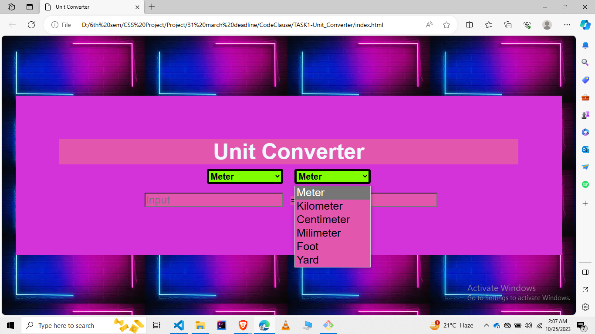

<h1 align="center"> Unit Converter </h1>

 
<h2 align="center">Hi there, Enjoy with the World of Open source contribution </h2>

Hello, Coders👨‍💻 ,I am Jatin Gupta, a aspiring Web developer.🤖 Here is the project of the front-end Web Developement. We all need nowadays to use the Unit conversion, so it will help us. So, here is the frontend Unit Conversion Website👆🏻 .

# Screenshots

# Video
[Not available]instead  screenshot available
