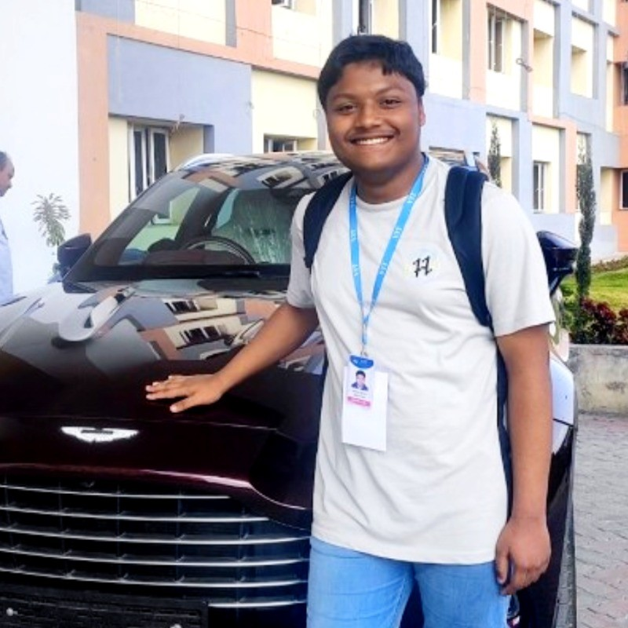

# <p align="center">METAVERSE</p>

<p align="center">
  
</p>

<div align="center">
  <p>
    <a href="https://github.com/ellerbrock/open-source-badges/">
      
    </a>
    
    
    
    
    
    
    
    
    
    
    
    
  </p>
</div>

<p align="center">
  
</p>

<h2>✨ Project Structure</h2> 

Check the project structure here [Project Structure](PROJECT_STRUCTURE.md)

<div>
  <h2>Table of Contents</h2>
  <ul>
    <li><a href="#about-metaverse">About METAVERSE</a></li>
    <li><a href="#announcement">Announcement</a></li>
    <li><a href="#achievement">Achievement</a></li>
    <li><a href="#available-projects">Available Projects</a></li>
    <li><a href="#blog">Blog</a></li>
    <li><a href="#what-can-you-contribute">What can you contribute?</a></li>
    <li><a href="#how-to-contribute">How to contribute?</a></li>
    <li><a href="#how-to-make-a-pull-request">How to make a pull request?</a></li>
    <li><a href="#quick-docker-setup">Quick Docker Setup</a></li>
    <li><a href="#project-contributors">Project Contributors</a></li>
    <li><a href="#license">License</a></li>
</ul>
</div>


 
<h2>📌 Open Source Program</h2>

<h3>This project is now OFFICIALLY accepted for</h3>

<p align="center">


  
</p>

<h3>This project was part of the following Open Source Programs</h3>

<p align="center">
  
  
  
   <br>
  
  
  
  
  
</p>


  
<h2 id="about-metaverse">About METAVERSE</h2>
Welcome to the "Metaverse Front-End Playground" – your gateway to the future of web development in the metaverse! 🌐🚀
Metaverse Front-End Playground is an open-source repository created to empower developers to explore, innovate, and collaborate in the metaverse space. Whether you're a seasoned developer looking to showcase your metaverse projects or a newcomer eager to dive into the virtual realm, you're invited to join our dynamic community!

We also have a Discord server to discuss doubts and suggestions! Make sure to join it here: <br />
[](https://discord.gg/dvHgzTMsap)

<h2 id="announcement">Announcement 📢</h2>

All of the projects of this repo can be seen in the deployment link in the **about** section

<h2 id="achievement">Achievement 🏆</h2>

**METAVERSE** repo has secured a position in *top 50 maintainer repositories* in **QUINE HACTOBERFEST** challenge 🏅

<h2 id="available-projects">Available Projects</h2>

<table >
<tr>
<td align="center">S.No</td>
<td align="center">Projects</td>
<td align="center">S.No</td>
<td align="center">Projects</td>
<td align="center">S.No</td>
<td align="center">Projects</td>
<td align="center">S.No</td>
<td align="center">Projects</td>
</tr>
<tr align="center">
<td align="center"> 1.</td>
<td align="center"> <a href="https://github.com/apu52/METAVERSE/tree/main/Projects/AI_Image%20_Generator">AI-Images-Generator</a>  </td>
<td align="center"> 2.</td>
<td align="center"> <a href="https://github.com/apu52/METAVERSE/tree/main/Projects/API_IMAGES">API_IMAGES</a></td>
<td align="center"> 3.</td>
<td align="center"> <a href="https://github.com/apu52/METAVERSE/tree/main/Projects/Age_Calculator">Age_Calculator</a></td>
<td align="center"> 4.</td>
<td align="center"> <a href="https://github.com/apu52/METAVERSE/tree/main/Projects/Amazon-Clone">Amazon-Clone</a></td>
</tr>

<tr align="center">
<td align="center"> 5.</td>
<td align="center"> <a href="https://github.com/apu52/METAVERSE/tree/main/Projects/Analog_Clock">Analog_Clock</a>  </td>
<td align="center"> 6.</td>
<td align="center"> <a href="https://github.com/apu52/METAVERSE/tree/main/Projects/Astronomy">Astronomy</a></td>
<td align="center"> 7.</td>
<td align="center"> <a href="https://github.com/apu52/METAVERSE/tree/main/Projects/AudioExtract">AudioExtract</a></td>
<td align="center"> 8.</td>
<td align="center"> <a href="https://github.com/apu52/METAVERSE/tree/main/Projects/BMI_Calculator">BMI_Calculator</a></td>
</tr>

<tr align="center">
<td align="center"> 9.</td>
<td align="center"> <a href="https://github.com/apu52/METAVERSE/tree/main/Projects/Bake_website">Bake_website</a>  </td>
<td align="center"> 10.</td>
<td align="center"> <a href="https://github.com/apu52/METAVERSE/tree/main/Projects/Band_Name_Generator">Band_Name_Generator</a></td>
</tr>


</table>

& many more.......

You can find All the Projects 
<h3>Live Project -- https://apu52.github.io/METAVERSE/</h3>

<h2 id="blog">Blog</h>

<h2>What You'll Discover Here:</h2>

- <h3>Diverse Metaverse Projects:</h3> Our repository features a wide spectrum of metaverse-related front-end projects. From HTML, CSS, and JavaScript to immersive React experiences, you'll find projects that push the boundaries of the metaverse.

- <h3>🤝 Collaboration:</h3> Metaverse Front-End Playground thrives on collaboration. You can enhance existing metaverse projects, contribute new features, or even conjure up entirely new metaverse experiences. Your creative contributions are highly valued!

- <h3>🚀Learning Opportunity:</h3> If you're new to metaverse development, this repository is an excellent launchpad. Collaborate with experienced metaverse developers, gain valuable insights, and immerse yourself in creating groundbreaking virtual worlds.

<h2 id="what-can-you-contribute">What can you contribute?</h2>

- Find All the details in [**CONTRIBUTING.md**](https://github.com/apu52/METAVERSE/blob/main/CONTRIBUTING.md) before contributing
- Please follow guidelines in [**Code_of_Conduct.md**](https://github.com/apu52/METAVERSE/blob/main/Code_of_conduct.md)

<h2 id="how-to-contribute">How to contribute?</h2>

- Drop a Star in this repo
- Take a look at the existing [Issues](https://github.com/apu52/METAVERSE/issues).
- Fork the Repo create a branch for any issue that you are working on and commit your work.
- At first raise an issue in which you want to work
- **Please do not make more than 2 issues at a time , Once your PR have been merged only then go for the next issue**
- **Then when you are get assigned only then work on that issue & make a PR**
- Please try to make a separate branch in your fork in case of PR
- Create a [**Pull Request**](https://github.com/apu52/METAVERSE/pulls), which will be promptly reviewed and given suggestions for improvements by the community.
- **REMINDER: Commit inside **the `Projects`** Folder**
- Find the already Existing Projects in the `Projects` Folder
- Add screenshots or video prototypes to your Pull Request to help us understand the effects of the changes that are included in your commits.

<h2> Installation and Setup</h2>

<h3> Prerequisites</h3>

- Node.js
- npm

<h3> Steps</h3>

1. **Clone the repository**:
   ```bash
   git clone https://github.com/apu52/METAVERSE.git
   ```
2. **Navigate to the project directory**:
    ```bash
   cd METAVERSE
   ```
  
3. **Install Dependencies**:
    ```bash
   npm install
   ```
4. **Run the project**:
   ```bash
   npm start
   ```
5. **Contribution Guidelines**
Move detailed steps to a new `CONTRIBUTING.md` file and link to it:


<p align="right"><a href="#top"></a></p>

<h2 id="how-to-make-a-pull-request">How to make a Pull Request?</h2>


**1.** Start by forking the [**METAVERSE**](https://github.com/apu52/METAVERSE) repository. Click on the <a href="https://github.com/apu52/METAVERSE/fork"></a> symbol at the top right corner.

**2.** Clone your forked repository:

```bash
git clone https://github.com/<your-github-username>/METAVERSE
```

**3.** Navigate to the new project directory:

```bash
cd METAVERSE
```

**4.** Set upstream command:

```bash
git remote add upstream https://github.com/apu52/METAVERSE
```

**5.** Create a new branch:

```bash
git checkout -b YourBranchName
```

<i>or</i>

```bash
git branch YourBranchName
git switch YourBranchName
```

**6.** Sync your fork or local repository with the origin repository:

- In your forked repository click on `Fetch upstream`.
- Click `Fetch and merge`.

<h3> Alternatively, Git CLI way to Sync forked repository with origin repository:</h3>

```bash
git fetch upstream
```

```bash
git merge upstream/main
```

<h3 id="github-docs-syncing">Github Docs for Syncing</h3>
<a href="https://docs.github.com/en/github/collaborating-with-pull-requests/addressing-merge-conflicts/resolving-a-merge-conflict-on-github">Read the documentation</a>

**7.** Make your changes to the source code.

**8.** Stage your changes and commit:

⚠️ **Make sure** not to commit `package.json` or `package-lock.json` file

⚠️ **Make sure** not to run the commands `git add .` or `git add *`. Instead, stage your changes for each file/folder

```bash
git add file/folder
```

```bash
git commit -m "<your_commit_message>"
```

**9.** Push your local commits to the remote repository:

```bash
git push origin YourBranchName
```

**10.** Create a [Pull Request](https://help.github.com/en/github/collaborating-with-issues-and-pull-requests/creating-a-pull-request)!

**Congratulations! You've made your first contribution!** 🙌🏼

<p align="right"><a href="#top"></a></p>
 
<h2 id="quick-docker-setup">Quick Docker Setup 🐳</h2>


<h3> Requirement:</h3>

* Docker Desktop

<h3>Let's Begin:</h3>

1. Make sure you have followed steps 1, 2, and 3 from the above procedure.
2. <h4>Verify Docker Status:</h4>
To ensure a seamless Docker experience, it's essential to check the status of the Docker service on your system.To verify whether the Docker service is currently active or inactive, you can use the following steps:
* Check Docker Service Status:
```bash
systemctl status docker
```
if it's inactive, you'll need to take corrective action.

* To activate the Docker service, use the following command:
```bash
systemctl start docker
```
3. <h4>Build</h4>
Now, let's build the Docker image named 'metaverse' using the docker build command:
```bash
docker build -t metaverse .
```
4. <h4>Run </h4>
Write the following command to run a Docker container named 'metaverseee'
```bash
docker run -d -p 3000:80 --name metaverseee metaverse
```
5. Wait until the ***[Container ID]*** appears.
6. Search the following syntax in your web browser to view the website.
```bash
localhost:3000
```
7. <h4>Stop: </h4>
Run the following command to stop the Docker container:
```bash
docker stop [container ID]
```

</br>
<p align = "center">
Show some ❤️&nbsp; by giving  to this repo
</p>

<div align="center">


<h2>GSSOC'24 Extended Mentor 👨‍💻</h2>

<table>
<tr>
<td align="center"><a href="https://github.com/Disha-Hati"></a></br> <h4 style="color:red;">Disha Hati</h4>
 <a href="https://www.linkedin.com/in/disha-hati-d55/"></img></a>
   </td>

</tr>
</table>

<table>
<tr>
<td align="center"><a href="https://github.com/kunal9960"></a></br> <h4 style="color:red;">Kunal Dalvi</h4>
 <a href="https://www.linkedin.com/in/kunal-dalvi-0b273b2b4/"></img></a>
   </td>

</tr>
</table>

<h2>GSSOC'24 Mentor 👨‍💻</h2>

<table>
<tr>
<td align="center"><a href="https://github.com/heysagnik"></a></br> <h4 style="color:red;">Sagnik Sahoo</h4>
 <a href="https://www.linkedin.com/in/heysagnik/"></img></a>
   </td>

</tr>
</table>

<h2>SSOC'24 Mentor 👨‍💻</h2>

<table>
<tr>
<td align="center"><a href="https://github.com/anuragverma108"></a></br> <h4 style="color:red;">Anurag Verma</h4>
 <a href="https://www.linkedin.com/in/anurag-verma-b91417253/"></img></a>
   </td>

</tr>
</table>


<div align="center">

<h2>METAVERSE Project Moderators(admin)</h2>

<table>
  <tr>
    <!-- Profile 1 -->
    <td align="center">
      <a href="https://github.com/5h0ov">
        
      </a><br>
      <h4 style="color:red;">Shuvadipta Das</h4>
      <a href="https://www.linkedin.com/in/shuvadipta-das-915b28216/">
        
      </a>
    </td>
    

  <td align="center">
      <a href="https://github.com/shruti-sen2004">
        
      </a><br>
      <h4 style="color:red;">Shruti Sen</h4>
      <a href="https://www.linkedin.com/in/shruti-sen-6b6924253/">
        
      </a>
    </td>

<!-- Profile 3 -->
   <td align="center">
      <a href="https://github.com/AnkitaSikdar005">
        
      </a><br>
      <h4 style="color:red;">Ankita Sikdar</h4>
      <a href="https://www.linkedin.com/in/ankita-sikdar-70210a253">
        
      </a>
    </td>
  </tr>
</table>
</div>

</div>

<div align="center">

 <h1>Project Admin</h1>

<table>
<tr>
<td align="center"><a href="https://github.com/apu52"></a></br> <h4 style="color:red;">Arpan Chowdhury</h4>
 <a href="https://www.linkedin.com/in/arpan-chowdhury-775294251/"></img></a>
   </td>

</tr>
</table>

</div>


<div align="center">


<h2 id="project-contributors">Project Contributors</h2>

<p align ="center">
  
</p>
<a href="https://github.com/apu52/METAVERSE/graphs/contributors">
  
</a> 

<div align="center">

Thank you to all the amazing contributors who have made this project possible!!💝

 
<h2> License</h2>


<p align="right"><a href="#top"></a></p>
