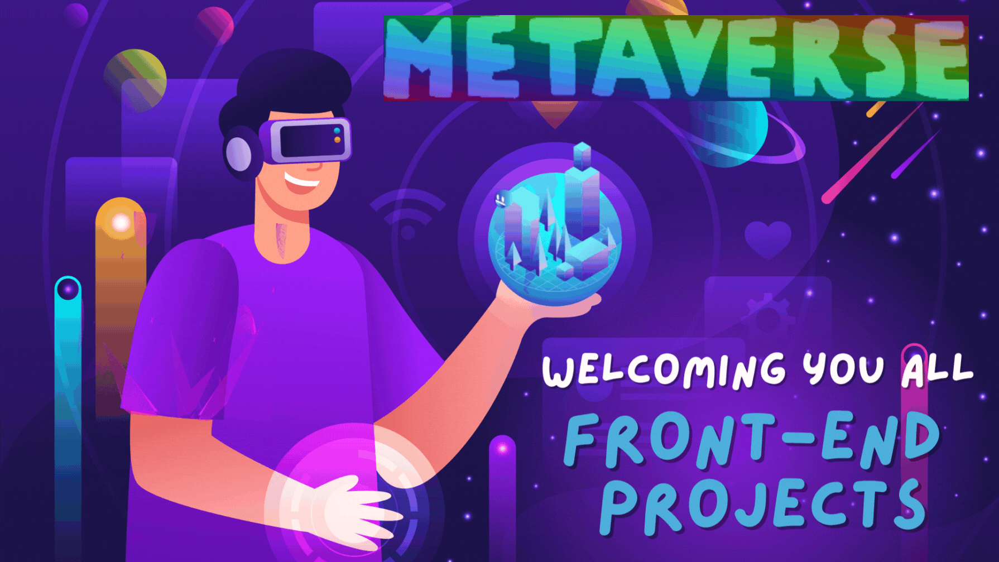
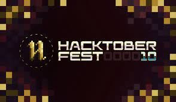

# <p align = "center"> METAVERSE </p>
  </img>
<div align="center">
 <p>

[](https://github.com/ellerbrock/open-source-badges/)


 </p>
 </div>
 <br>
 <p align="center">
   
</p>
 
 
 ## 📌 Open Source Program

### This project is a part of following Open Source Programs

<div align="center">
  
  
</div>

### This project was previously part of following Open Source Programs

<div align="center">
  
  
  
</div>
  
##  About METAVERSE
Welcome to the "Metaverse Front-End Playground" – your gateway to the future of web development in the metaverse! 🌐🚀
Metaverse Front-End Playground is an open-source repository created to empower developers to explore, innovate, and collaborate in the metaverse space. Whether you're a seasoned developer looking to showcase your metaverse projects or a newcomer eager to dive into the virtual realm, you're invited to join our dynamic community!

We also have a Discord server to discuss doubts and suggestions! Make sure to join it here: https://discord.gg/dvHgzTMsap

## Announcement 📢
All of the projects of this repo can be seen in the deployment link in the **about** section

## Achievement 🏆

**METAVERSE** repo has secured a position in *top 50 maintainer repositories* in **QUINE HACTOBERFEST** challenge 🏅

## Blog

<h2>What You'll Discover Here:</h2>

- <h3>Diverse Metaverse Projects:</h3> Our repository features a wide spectrum of metaverse-related front-end projects. From HTML, CSS, and JavaScript to immersive React experiences, you'll find projects that push the boundaries of the metaverse.

- <h3>🤝 Collaboration:</h3> Metaverse Front-End Playground thrives on collaboration. You can enhance existing metaverse projects, contribute new features, or even conjure up entirely new metaverse experiences. Your creative contributions are highly valued!


- <h3> 🎉 KWOC'23 Affiliation:</h3> We're thrilled to be part of KWOC'23, the global celebration of open source. By contributing to Metaverse Front-End , you can earn KWOC'23 rewards and swag while shaping the future of the metaverse between the time span of December 9,2023 to January 15,2024.

- <h3>🚀Learning Opportunity:</h3> If you're new to metaverse development, this repository is an excellent launchpad. Collaborate with experienced metaverse developers, gain valuable insights, and immerse yourself in creating groundbreaking virtual worlds.

## What you can Contribute?

- Find All the details in [**CONTRIBUTING.md**](https://github.com/apu52/METAVERSE/blob/main/CONTRIBUTING.md) before contributing
- Please follow guidelines in [**Code_of_Conduct.md**](https://github.com/apu52/METAVERSE/blob/main/Code_of_conduct.md)

## How to Contribute?

- Drop a Star in this repo
- Take a look at the existing [Issues](https://github.com/apu52/METAVERSE/issues).
- Fork the Repo create a branch for any issue that you are working on and commit your work.
- At first raise an issue in which you want to work
- **Please do not make more than 2 issues at a time , Once your PR have been merged only then go for the next issue**
- **Then when you are get assigned only then work on that issue & make a PR**
- Please try to make a separate branch in your fork in case of PR
- Create a [**Pull Request**](https://github.com/apu52/METAVERSE/pulls), which will be promptly reviewed and given suggestions for improvements by the community.
- **REMINDER: Commit inside **the `Projects`** Folder**
- Add screenshots or video prototypes to your Pull Request to help us understand the effects of the changes that are included in your commits.
- **Make sure to add a proper README.md with tour PR that describes your project**
- **Make sure to add the img of your new project in the `assets/img` folder**
- **Make sure to Update `projectData.json` file after submitting PR**

## How to make a Pull Request?

**1.** Start by forking the [**METAVERSE**](https://github.com/apu52/METAVERSE) repository. Click on the <a href="https://github.com/apu52/METAVERSE/fork"></a> symbol at the top right corner.

**2.** Clone your forked repository:

```bash
git clone https://github.com/<your-github-username>/METAVERSE
```

**3.** Navigate to the new project directory:

```bash
cd METAVERSE
```

**4.** Set upstream command:

```bash
git remote add upstream https://github.com/apu52/METAVERSE
```

**5.** Create a new branch:

```bash
git checkout -b YourBranchName
```

<i>or</i>

```bash
git branch YourBranchName
git switch YourBranchName
```

**6.** Sync your fork or local repository with the origin repository:

- In your forked repository click on `Fetch upstream`.
- Click `Fetch and merge`.

### Alternatively, Git CLI way to Sync forked repository with origin repository:

```bash
git fetch upstream
```

```bash
git merge upstream/main
```

### [Github Docs](https://docs.github.com/en/github/collaborating-with-pull-requests/addressing-merge-conflicts/resolving-a-merge-conflict-on-github) for Syncing

**7.** Make your changes to the source code.

**8.** Stage your changes and commit:

⚠️ **Make sure** not to commit `package.json` or `package-lock.json` file

⚠️ **Make sure** not to run the commands `git add .` or `git add *`. Instead, stage your changes for each file/folder

```bash
git add file/folder
```

```bash
git commit -m "<your_commit_message>"
```

**9.** Push your local commits to the remote repository:

```bash
git push origin YourBranchName
```

**10.** Create a [Pull Request](https://help.github.com/en/github/collaborating-with-issues-and-pull-requests/creating-a-pull-request)!

 <h2>Congratulations! You've made your first contribution! 🙌🏼</h2>

</br>
<p align = "center">
Show some ❤️&nbsp; by giving  to this repo
</p>

## Project Contributors

<p align ="center">
  
</p>
<a href="https://github.com/apu52/METAVERSE/graphs/contributors">
<p align = "center" ></p>
</a>
<div align="center">

 # Project Admin
<table>
<tr>
<td align="center"><a href="https://github.com/apu52"></a></br> <h4 style="color:red;">Arpan Chowdhury</h4>
 <a href="https://www.linkedin.com/in/arpan-chowdhury-775294251/"></img></a>
   </td>

</tr>
</table>

## Project Admin/Moderators

<table>
<tr>
<td align="center"><a href="https://github.com/5h0ov"></a></br> <h4 style="color:red;">Shuvadipta Das</h4>
 <a href="https://www.linkedin.com/in/shuvadipta-das-915b28216/"></img></a>
   </td>

</tr>
</table>

<table>
<tr>
<td align="center"><a href="https://github.com/shruti-sen2004"></a></br> <h4 style="color:red;">Shruti Sen</h4>
<a href="https://www.linkedin.com/in/shruti-sen-6b6924253/"></img></a>
 </td>

</tr>
</table>

<table>
<tr>
<td align="center"><a href=" https://github.com/AnkitaSikdar005"></a></br> <h4 style="color:red;">Ankita Sikdar</h4>
<a href="https://www.linkedin.com/in/ankita-sikdar-70210a253"></img></a>
 </td>

</tr>
</table>
</div>
